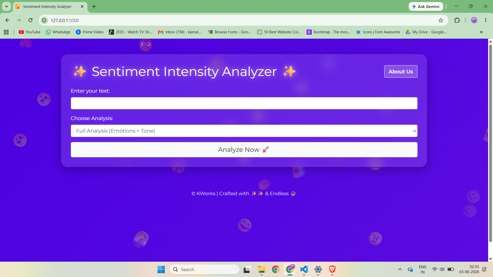
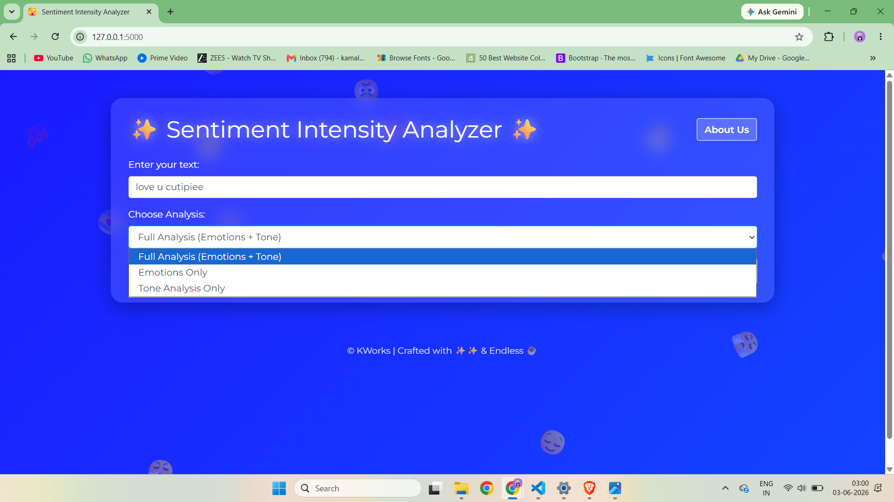
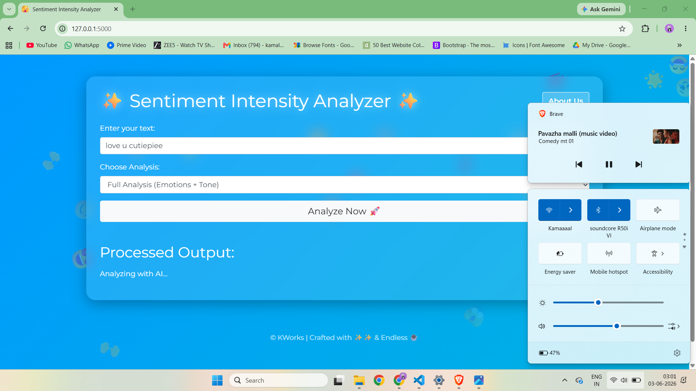
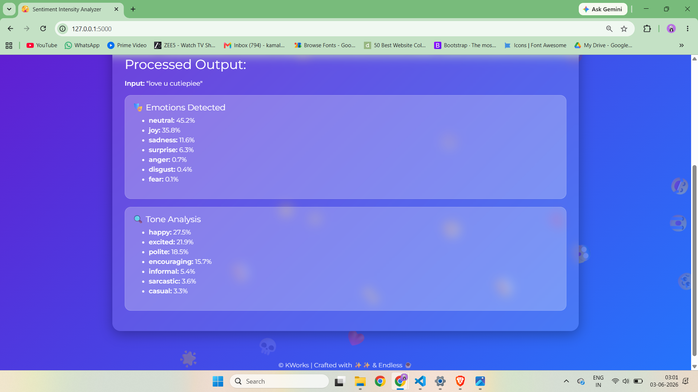
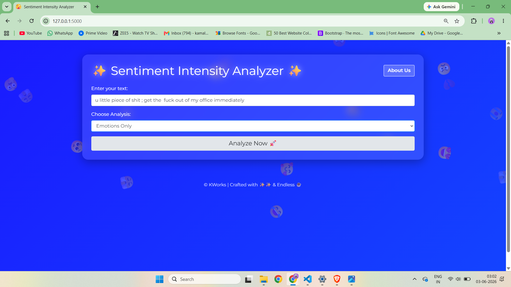
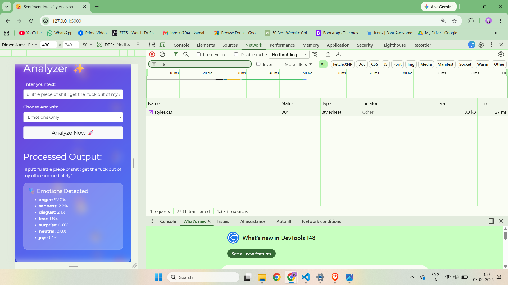
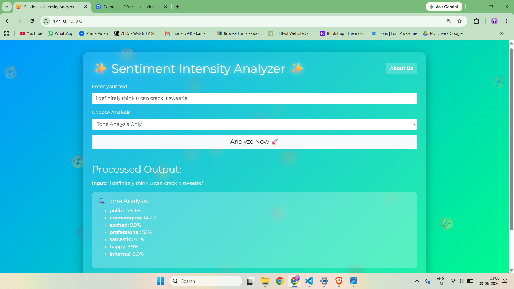
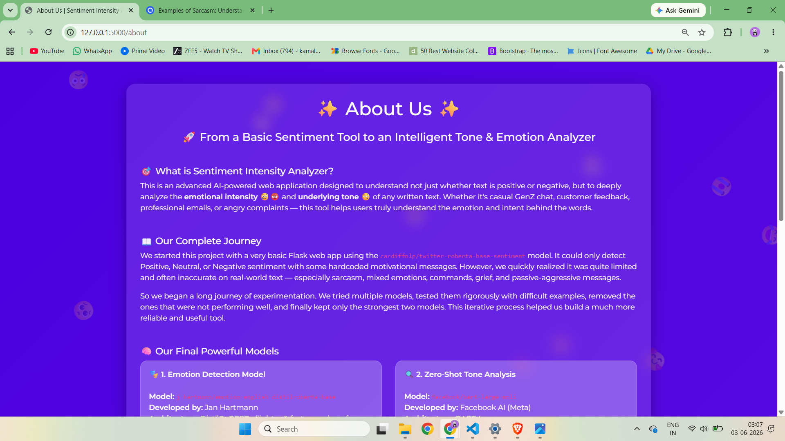
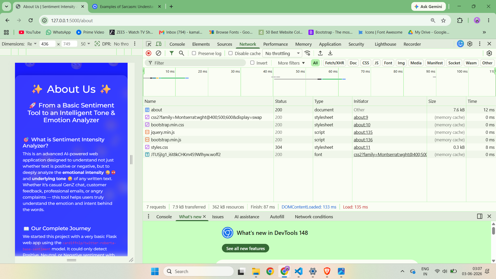
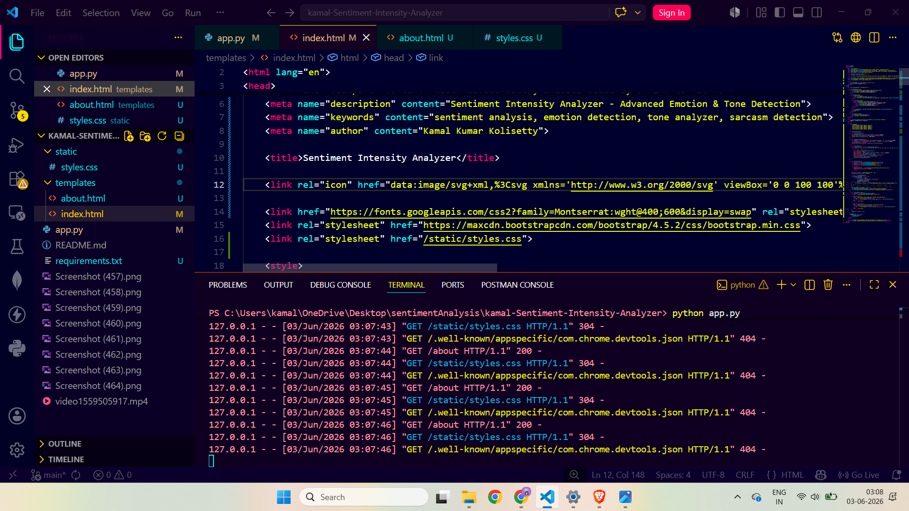

<!-- PORTFOLIO DATA
title: Sentiment Intensity Analyzer
description: An AI-powered NLP platform that goes beyond basic sentiment analysis to detect emotions, communication tone, sarcasm, threats, professionalism, and intent using state-of-the-art Transformer models. Built with Flask, PyTorch, and Hugging Face Transformers, featuring confidence-based predictions, interactive visualizations, and a modern responsive UI.
skills: Python, Flask, PyTorch, Hugging Face Transformers, NLP, Bootstrap, JavaScript, HTML, CSS
image: https://github.com/kamalkolisetty/kamal-Sentiment-Intensity-Analyzer/blob/main/screenshots/77.png?raw=true
-->

# ✨ Sentiment Intensity Analyzer

> **An AI-Powered Emotion & Tone Intelligence Platform Built with Flask, Transformers, and PyTorch**



---

# 📌 Overview

**Sentiment Intensity Analyzer** is an advanced Natural Language Processing (NLP) web application designed to analyze human text beyond traditional sentiment analysis.

Most sentiment analysis tools classify text into only three categories:

* Positive 😊
* Neutral 😐
* Negative 😞

While useful, this approach often fails to capture the complexity of real human communication.

For example:

> "Wow, great job breaking the production server again."

Traditional sentiment analyzers frequently classify this statement as **positive** because of words such as *great job*, while humans immediately recognize it as **sarcastic criticism**.

This project addresses that limitation by combining:

* Emotion Detection
* Tone Classification
* Confidence Scoring
* Interactive Visualizations
* Modern User Experience Design

The result is a system capable of identifying not only *what* someone is saying, but also *how* they are saying it.

---

# 🎯 Problem Statement

Human communication contains far more information than simple positive or negative sentiment.

A sentence can simultaneously contain:

* Anger
* Disappointment
* Fear
* Encouragement
* Sarcasm
* Professionalism
* Threats
* Politeness

Traditional sentiment analyzers often miss these nuances.

This project was developed to bridge that gap by providing a richer understanding of textual communication.

---

# 🚀 Features

## 1. Full AI Analysis

Performs complete analysis of user input by combining:

### Emotion Detection

Detects emotional states such as:

* Joy 😊
* Anger 😡
* Sadness 😢
* Fear 😨
* Surprise 😲
* Disgust 🤢
* Neutral 😐

### Tone Analysis

Identifies communication styles such as:

* Sarcastic 😏
* Threatening 💀
* Angry 😠
* Polite 🙏
* Professional 💼
* Casual 😂
* Encouraging 🌟
* Disappointed 😞
* Rude 😤

---

## 2. Emotion-Only Mode

Provides detailed emotional breakdowns without performing tone analysis.

Useful for:

* Mental health research
* Customer feedback analysis
* Social media monitoring
* Journal reflection analysis

---

## 3. Tone-Only Mode

Focuses exclusively on communication style and intent.

Useful for:

* Email review
* Workplace communication analysis
* Customer support evaluation
* Brand reputation monitoring

---

## 4. Confidence-Based Results

Instead of returning a single label, the system displays:

* Top predictions
* Confidence percentages
* Ranking of emotions
* Ranking of tones

This provides greater transparency into model decisions.

---

## 5. Dynamic User Experience

The application includes several UI enhancements:

### Floating Emoji Animations

Animated emotion icons create an engaging and playful experience.

### Dynamic Gradient Backgrounds

Each analysis generates a new visual theme.

### Loading Animations

Custom AI processing indicators improve perceived responsiveness.

### Mobile Responsive Design

Optimized for:

* Desktop
* Tablet
* Mobile Devices

---

# 🧠 AI Models Used

---

## Emotion Detection Model

### Model

`j-hartmann/emotion-english-distilroberta-base`

### Architecture

DistilRoBERTa

### Why This Model?

After extensive testing against multiple emotion classification models, this model consistently delivered:

* Higher accuracy
* Better contextual understanding
* Improved handling of nuanced emotional expressions

### Emotions Detected

| Emotion  | Description           |
| -------- | --------------------- |
| Joy      | Happiness, excitement |
| Anger    | Frustration, rage     |
| Sadness  | Grief, disappointment |
| Fear     | Anxiety, concern      |
| Surprise | Shock, amazement      |
| Disgust  | Aversion, contempt    |
| Neutral  | Emotionally balanced  |

### Output Example

```json
{
  "joy": 67.3,
  "surprise": 14.8,
  "neutral": 8.1,
  "fear": 4.2,
  "sadness": 2.7,
  "anger": 1.8,
  "disgust": 1.1
}
```

---

## Tone Classification Model

### Model

`facebook/bart-large-mnli`

### Architecture

BART Large

### Training Dataset

MultiNLI (MNLI)

Approximate dataset size:

* 433,000+ sentence pairs

### Why This Model?

Unlike traditional classifiers that require retraining for new categories, BART-MNLI supports:

### Zero-Shot Classification

Meaning:

> The model can classify text into completely custom categories without additional training.

This makes it extremely flexible.

---

### Supported Tone Categories

Examples include:

* Sarcastic
* Threatening
* Polite
* Professional
* Casual
* Friendly
* Encouraging
* Rude
* Angry
* Disappointed
* Optimistic
* Pessimistic

Additional categories can be added instantly.

---

# 🏗️ System Architecture

```text
User Input
     │
     ▼
Flask Backend
     │
     ├──────────────► Emotion Model
     │                     │
     │                     ▼
     │              Emotion Scores
     │
     └──────────────► Tone Model
                           │
                           ▼
                     Tone Scores
                           │
                           ▼
                  Result Aggregator
                           │
                           ▼
                     Interactive UI
```

---

# 📖 Development Journey

This project evolved through several iterations.

## Phase 1

Started with:

```text
cardiffnlp/twitter-roberta-base-sentiment
```

Output:

```text
Positive
Neutral
Negative
```

Although functional, it struggled with:

* Sarcasm
* Mixed emotions
* Complex sentences
* Contextual understanding

---

## Phase 2

Experimented with multiple NLP models including:

* CardiffNLP Models
* NLP Town Models
* TabularisAI Models
* Various Emotion Classifiers
* Formality Detection Models

A custom evaluation suite was created using:

* Customer reviews
* Workplace emails
* Social media comments
* Sarcastic statements
* Emotional conversations

---

## Phase 3

Weak models were removed.

The final architecture retained only:

* DistilRoBERTa Emotion Classifier
* BART-MNLI Tone Classifier

This significantly improved:

* Accuracy
* Interpretability
* Performance
* User experience

---

# 🛠️ Technology Stack

## Backend

* Python
* Flask

## Machine Learning

* Hugging Face Transformers
* PyTorch

## Frontend

* HTML5
* CSS3
* JavaScript
* Bootstrap 4

## Styling

* Glassmorphism UI
* CSS Animations
* Dynamic Gradients

## Deployment

Compatible with:

* Render
* Railway
* Heroku
* AWS EC2
* Azure App Services
* Docker Containers

---

# 📂 Project Structure

```text
Sentiment-Intensity-Analyzer/
│
├── app.py
│
├── templates/
│   ├── index.html
│   └── about.html
│
├── static/
│   ├── styles.css
│   ├── script.js
│   └── assets/
│
├── screenshots/
│
├── requirements.txt
│
├── README.md
│
└── .gitignore
```

---

# 📸 Demonstration
 
### 1. Homepage 


### 2. Analysis Options




### 3. "Analyzing with AI..." Screen




### 4. Full Analysis Output Example




### 5. Emotions Only Output (Anger Example)




### 6. Mobile View - Responsiveness




### 7. Tone Only Analysis (Sarcastic Example)





### 8-9. About Us Page (Desktop + Mobile)







### 10. Project Structure in VS Code





---

# ⚙️ Installation

## Prerequisites

* Python 3.9+
* Pip
* Internet Connection (first run only)

---

## Clone Repository

```bash
git clone https://github.com/kamalkolisetty/Sentiment-Intensity-Analyzer.git

cd Sentiment-Intensity-Analyzer
```

---

## Install Dependencies

```bash
pip install -r requirements.txt
```

Or manually:

```bash
pip install flask transformers torch torchvision torchaudio
```

---

## Run Application

```bash
python app.py
```

---

Open Browser:

```text
http://127.0.0.1:5000
```

---

## First Run Note

The first launch downloads transformer models.

Expected download size:

```text
~1.5 GB
```

Subsequent launches are significantly faster because models are cached locally.

---

# 📊 Potential Use Cases

## Business

* Customer feedback analysis
* Product review insights
* Brand monitoring

## Education

* Student feedback analysis
* Essay tone evaluation

## Human Resources

* Employee sentiment monitoring
* Workplace communication review

## Social Media

* Community moderation
* Public opinion analysis

## Personal Productivity

* Email tone checking
* Journal emotion tracking

---

# 🔮 Future Enhancements

Planned improvements include:

### User Features

* User authentication
* Analysis history
* Saved reports

### AI Features

* Multilingual support
* Hinglish detection
* Regional language support
* Custom fine-tuning

### Export Options

* PDF Reports
* CSV Export
* API Access

### UI Improvements

* Dark Mode
* Light Mode
* Custom Themes

---
 
 

# ⭐ Support

If you found this project useful:

* Star the repository
* Fork the project
* Share feedback
* Suggest improvements

Contributions are always welcome.

---

# 📜 License

This project is released under the MIT License.

Feel free to use, modify, and distribute it for educational and commercial purposes.

---

## ❤️ Acknowledgements

Special thanks to:

* Hugging Face
* PyTorch
* Flask
* Open Source NLP Community

for providing the tools and frameworks that made this project possible.

---
 

 

# 💭 Final Thoughts

Language is one of humanity's most powerful inventions.

Yet understanding language isn't just about understanding words.

It's about understanding:

* Emotions
* Intentions
* Context
* Nuance
* Tone
* Human Experience

The future of Artificial Intelligence isn't simply teaching machines to read text.

It's teaching them to understand the people behind that text.

This project is a small step toward that future.

One sentence at a time.

---
 

### Crafted with ❤️ to help machines understand not just words, but the emotions behind them.**

## © KWorks | Crafted with ✨, AI & Endless ☕

---

